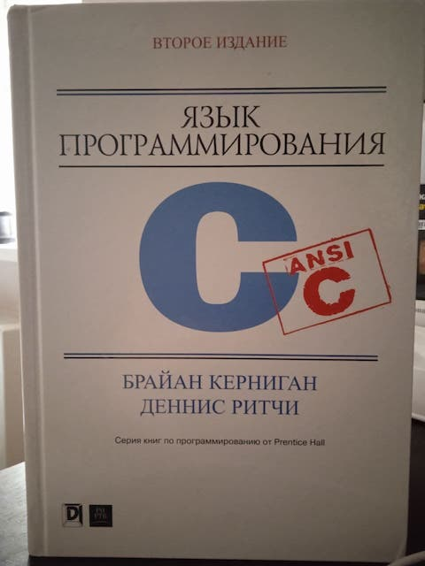

**Решение задач из классической книги Кернигана и Ритчи**

**Solving problems from the classic book by Kernighan and Ritchie**



1. [Обзор языка (A Tutorial Introduction)](/chapter1)
2. [Типы, операторы и выражения (Types, Operators and Expressions)](/chapter2)
3. [Управление(Control Flow)](/chapter3)
4. [Функции и структура программы (Functions and Program Structure)](/chapter4)

```
 _____       _          __             
|  _  |     | |        / _|            
| | | |_ __ | |_   _  | |_ _   _ _ __  
| | | | '_ \| | | | | |  _| | | | '_ \ 
\ \_/ / | | | | |_| | | | | |_| | | | |
 \___/|_| |_|_|\__, | |_|  \__,_|_| |_|
                __/ |                  
               |___/                   
               
=======================================               
 
 _____       _         _____ 
|  _  |     | |       /  __ \
| | | |_ __ | |_   _  | /  \/
| | | | '_ \| | | | | | |    
\ \_/ / | | | | |_| | | \__/\
 \___/|_| |_|_|\__, |  \____/
                __/ |        
               |___/                                          
```